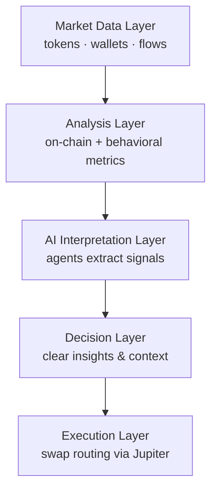

<h1 align="center">Blitzari Terminal</h1>

  <b>Signal → Context → Execution</b> 
  AI trading surface for Solana built for speed, clarity, and control

---

> [!IMPORTANT]
> Blitzari is a non-custodial AI trading terminal — you control every action

> [!TIP]
> Designed for users already inside crypto flow: wallets, tokens, Telegram, execution

---

# Overview

Blitzari is not a dashboard  
It is a decision surface

You scan  
You understand  
You act

All in one flow

---

# What You Get

| Layer | Output |
|---|---|
| Signal | Live token discovery |
| Context | AI + on-chain analytics |
| Decision | Structured insights |
| Execution | Jupiter routing |

---

# Key Features

## WHAT IT IS

A high-speed AI terminal for Solana trading  
built around wallets, agents, and real-time analysis

---

## WHAT IT DOES

| Feature | Result |
|---|---|
| Token Scan | Detect movement, volume, liquidity |
| Wallet Analysis | Understand behavior and intent |
| AI Agents | Turn noise into structured insight |
| Terminal | Navigate markets in real time |
| Execution | Swap directly via Jupiter |

---

## System Design

| Principle | Meaning |
|---|---|
| Wallet-native | No accounts, only wallets |
| Credit-based | Pay per action |
| Agent-driven | Structured outputs, not chat |
| Non-custodial | You approve everything |

---

> [!WARNING]
> Blitzari cannot move funds and does not auto-trade

---

# Try It

## Quick Flow

1. Connect wallet  
2. Run analysis  
3. Review output  
4. Decide  
5. Execute  

---

## Entry Points

| Entry | Action |
|---|---|
| Terminal | Discover tokens |
| Wallet | Analyze positions |
| Agent | Generate insights |

---

> [!IMPORTANT]
> Execution only happens after your wallet confirmation

---

# Integrations

| Layer | Usage |
|---|---|
| Telegram | Agents inside chat |
| Extension | Overlay insights |
| API | Build systems |
| Webhooks | Real-time events |

---

# Tech Stack

| Component | Stack |
|---|---|
| UI | React + Tailwind |
| AI | Proprietary models |
| Chain | Solana |
| Routing | Jupiter |
| Backend | API + analytics |
| Realtime | Events + webhooks |

---

# How It Works

Blitzari is built as a layered decision system — not a linear pipeline

Each layer reduces noise and moves you closer to action

### Layer Breakdown

| Layer | Role |
|---|---|
| Market Data | Raw on-chain and market inputs |
| Analysis | Structured metrics and patterns |
| AI Layer | Signal extraction and summarization |
| Decision | Human-readable insights |
| Execution | User-confirmed trade routing |

> [!IMPORTANT]
> Blitzari does not automate decisions — it compresses complexity into clarity so you can act faster

---

# Token & Credits

| Action | Cost |
|---|---|
| Analysis | Credits |
| Research | Credits |

| Flow | % |
|---|---|
| Burn | 80 |
| Treasury | 20 |

---

> [!NOTE]
> Usage directly impacts token supply via burn mechanics

---

# Security

| Layer | Model |
|---|---|
| Custody | None |
| Keys | Never stored |
| Execution | Wallet-only |
| Data | Minimal |

---

> [!CAUTION]
> Keep your keys private — Blitzari will never request them

---

# Disclaimer

Blitzari provides data, analysis, and AI-generated insights

Not financial advice  
All actions are user decisions
